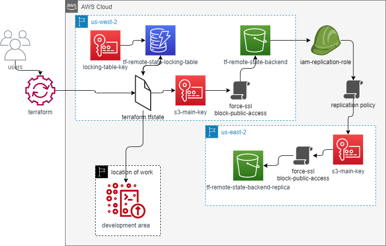

# aws_db_instance

## Module Usage

```hcl
provider "aws" {
  region  = local.region
  profile = "aws-gl-sandbox"
}

provider "aws" {
  alias   = "replica"
  region  = local.replica_region
  profile = "aws-gl-sandbox"
}

locals {
  region         = "us-west-2"
  replica_region = "us-east-1"  
  tags   = {
    "symplr-environment"    = "test" 
    "symplr-costaccounting" = "it"
    "symplr-pointofcontact" = "monitoring-it-systems@symplr.com"
    "symplr-purpose"        = "terraform deployment testing"          
  }
}

module "backend_test" {
  source        = "../"
  project       = "sprovider"
  force_destroy = true
                            
  providers = {
    aws         = aws
    aws.replica = aws.replica
  }

  tags               = local.tags 
}
```
after running the tf, you can then run init again with an example of the following. 

```hcl

...
terraform {
  backend "s3" {
    bucket         = "tf-remote-state-sprovider-backend"
    key            = "accounts/backend/terraform.tfstate"
    region         = "us-west-2"
    encrypt        = true
    kms_key_id     = "arn:aws:kms:us-west-2:289031936666:key/a39fdbb8-2a7d-486a-975d-ce551bd40c01"
    dynamodb_table = "tf-remote-state-sprovider-locking-table"
    profile        = "aws-gl-sandbox"
  }
}
...

```
## Requirements

| Name | Version |
|------|---------|
| terraform | >= 1.1.4 |
| aws | >= 4.3.0 |

## Providers

| Name | Version |
|------|---------|
| aws | >= 4.3.0 |

## Resources
| Name | Version |
|------|---------|
| [aws_kms_key](https://registry.terraform.io/providers/hashicorp/aws/latest/docs/resources/kms_key) | resource |
| [aws_kms_alias](https://registry.terraform.io/providers/hashicorp/aws/latest/docs/resources/kms_alias) | resource |
| [aws_dynamodb_table](https://registry.terraform.io/providers/hashicorp/aws/latest/docs/resources/dynamodb_table) | resource |
| [aws_s3_bucket](https://registry.terraform.io/providers/hashicorp/aws/latest/docs/resources/s3_bucket) | resource |
| [aws_s3_bucket_public_access_block](https://registry.terraform.io/providers/hashicorp/aws/latest/docs/resources/s3_bucket_public_access_block) | resource |
| [aws_s3_bucket_policy](https://registry.terraform.io/providers/hashicorp/aws/latest/docs/resources/s3_bucket_policy) | resource |
| [aws_iam_role](https://registry.terraform.io/providers/hashicorp/aws/latest/docs/resources/iam_role) | resource |
| [aws_iam_policy](https://registry.terraform.io/providers/hashicorp/aws/latest/docs/resources/iam_policy) | resource |
| [aws_iam_policy_attachment](https://registry.terraform.io/providers/hashicorp/aws/latest/docs/resources/iam_policy_attachment) | resource |
| [aws_s3_bucket_replication_configuration](https://registry.terraform.io/providers/hashicorp/aws/latest/docs/resources/s3_bucket_replication_configuration) | resource |
| [aws_s3_bucket_versioning](https://registry.terraform.io/providers/hashicorp/aws/latest/docs/resources/s3_bucket_versioning) | resource |
| [aws_s3_bucket_server_side_encryption_configuration](https://registry.terraform.io/providers/hashicorp/aws/latest/docs/resources/s3_bucket_server_side_encryption_configuration) | resource |
 
## Inputs
| Name | Description | Type | Default | Required |
|------|-------------|------|---------|:--------:|
| `project` | the name of the project | `string` | `null` | yes |
| `force_destroy` | to force destroy the buckeet | `bool` | `false` | no |
| `tags ` | a mapping of tags | `map` | `{}` | no |

